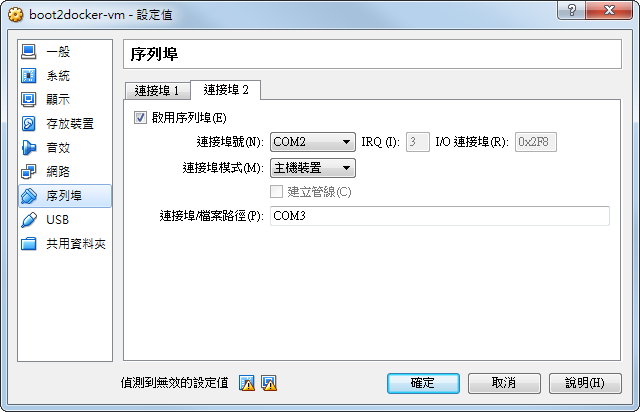

# docker-ino

Ino is a command line toolkit for working with Arduino hardware.

The docker image helps you to run ino in docker to serve the purpose.

## Quickstart

Use coopermaa/ino image in an alias to deal with ino:

    $ alias ino='docker run --privileged \
      -v /dev/ttyS1:/dev/ttyS1 \
      -v $(pwd):/app \
      coopermaa/ino'

Notes: You can save the alias setting in ~/.profile or ~/.bashrc

Create a simple project and use blink as a project template which will create a simple sketch for LED blinking on pin 13:

    $ mkdir blink
    $ ino init -t blink

If you look at the contents of your blink directory, you should see a lib and a src directory. Within src, there will be a file called sketch.ino

Let's build it and upload it:

    $ ino build
    $ ino upload -p /dev/ttyS1

When the job is done, Arduino flashes with its buil-in LED on pin 13.

## Tweaking parameters

All examples were done in assumption that you have Arduino Uno. 
If you have Arduino Mega 2560 and it is available on port /dev/ttyACM1. 
We have to specify this for our build steps as command-line switches (You have to update the alias setting too):

    $ ino build -m mega2560
    $ ino upload -m mega2560 -p /dev/ttyACM1

See [official ino documentaio](http://inotool.org/quickstart) for more information.

## For boot2docker user on Windows

First, get the serial port number associated with your Arduino board (use Device Manager).

Shutdown your VM if you still have it open. Don't save the state - completely shut it down:

    $ boot2docker halt

Now navigate to VirtualBox, select the VM "boot2docker-vm" and then click settings. 
Select the "Serial Ports" option on the left hand side.

Click the "Port 2" tab, and then select "Enable Serial Port". For the Port Number, set to COM2. 
This tells VirtualBox to have the Arduino board mounted at /dev/ttyS1. For the Port Mode, select "Host Device". 
For "Port/File Path:", Enter in COM#. The colon needs to be there.

That's it for configuring VirtualBox. Bring your VM back up and start to play ino.
